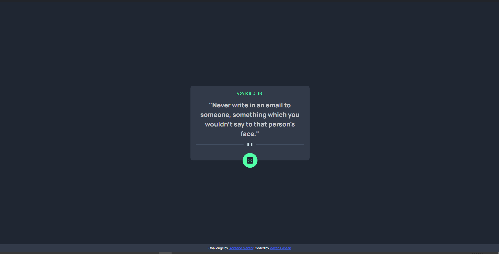

# Frontend Mentor - Advice generator app solution

This is a solution to the [Advice generator app challenge on Frontend Mentor](https://www.frontendmentor.io/challenges/advice-generator-app-QdUG-13db). Frontend Mentor challenges help you improve your coding skills by building realistic projects.

## Table of contents

- [Frontend Mentor - Advice generator app solution](#frontend-mentor---advice-generator-app-solution)
  - [Table of contents](#table-of-contents)
    - [The challenge](#the-challenge)
    - [Screenshot](#screenshot)
    - [Links](#links)
    - [Built with](#built-with)
    - [What I learned](#what-i-learned)
    - [Useful resources](#useful-resources)


### The challenge

Users should be able to:

- View the optimal layout for the app depending on their device's screen size
- See hover states for all interactive elements on the page
- Generate a new piece of advice by clicking the dice icon

### Screenshot




### Links

- Solution URL: [Solution URL](https://www.frontendmentor.io/solutions/advice-generator-using-scss-and-js-8UcGYJhvP_)
- Live Site URL: [Live Site URL](https://advice-generator-app-pi-two.vercel.app/)

### Built with

- Semantic HTML5 markup
- CSS custom properties
- Flexbox
- CSS Grid
- Mobile-first workflow
- [Styled Components](https://styled-components.com/) - For styles


### What I learned
- Learned how to work with fetching API and asyn await and return either a response or an error when failed.
- Learned using transform to effeciently achieve an element position in document.
- Learned to use custom animate method in JS and implement it in the desired action.

```css
.advice-button {
    position: absolute;
    bottom: 0;
    transform: translateY(50%);
    transition: all 0.2s ease-in;
    
}
```
```js
const diceRotateAnimation = [
    { transform: "rotate(0)" },
    { transform: "rotate(0.5turn)" },
];
const diceRotateTiming = {
    duration: 300,
    iterations: 1,
}
```

### Useful resources

- [animate method in JS](https://developer.mozilla.org/en-US/docs/Web/API/Element/animate) - This helped me to use custom keyframes inside JS and assign it when clicking a button
- [Fetching API on Youtube](https://www.youtube.com/watch?v=37vxWr0WgQk) - This video was very useful and it let me understand API and how to properly use it
